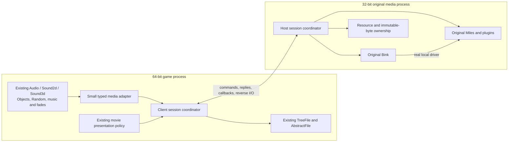

# Original media bridge: architecture proposal

2026-09-30. Product reference: `49d0eeed4ddaa177d7a93ea396c37c3d9b9942da`.
Status: design for the next experimental integration, **not an adopted production backend**. Component implementations below are candidates. No full x64 client runs yet. The real Win32 Audio/Sound2d baseline still fails teardown.

## The boundary

Keep the original game’s audio decisions in the x64 client. Keep original Miles, its plugins, its real audio device and the Bink code using that device together in one x86 child process. Move calls and explicitly owned data across that boundary; do not recreate the mixer, decoder or game audio policy.

The 61-function inventory is a coverage checklist, not a requirement to build a general remote DLL system. The bridge supports the exact reachable game surface. A few honest adapter changes carry information that the old signatures hide: image byte extent, version-resource queries, returned text ownership and the Bink driver relationship. It does not manufacture a DLL whose exports link but have no behavior.

Moving all of clientAudio into x86 is a real rival, but it also moves shared RNG consumption, Object/Appearance watchers, cell/hardpoint observations and game callbacks across the boundary. That is a larger game-state protocol. See [source comparison](../../audio-next/whole-subsystem-rival-audit.md). The current preference for the vendor boundary follows from those dependencies, not from a claim that fine-grained RPC is free.

## Five responsibilities, one owner for each rule

| Component | Owns | Does not own |
|---|---|---|
| Game adapter | Typed local proxies; actual argument/output presence; translating known image extents | Mixing, fake playheads, sound selection, cached vendor answers |
| Session coordinator | Process/channel lifetime, identity, request ordering, callback admission, lock lease and shutdown state | Vendor algorithms or generic game-state replication |
| Codec and resource store | Checked fixed-width bytes, generations, parent aliases, immutable input copies | Proof that vendor callbacks finished or that input represents a valid codec file |
| x86 vendor backend | Genuine SDK calls, local pointers, plugins and original driver | Game Object/RNG state or client virtual-file precedence |
| File/video adapters | TreeFile reverse operations; original Bink decode commands and returned frame surfaces | An alternate file system, free-running movie clock or second audio device |

There must be one coordinator, not a separate lifetime/locking policy in every AIL wrapper. Existing `callbacksQuiesced` booleans and single-thread comments are component preconditions. Before integration they must be supplied by an actual coordinator state transition and completion evidence; a caller passing `true` is not an implementation of quiescence.

## Transport and identity

Start with bounded fixed-width frames over two private, local duplex named-pipe channels: command/results, and callbacks/reverse I/O. Use overlapped reads/writes and an I/O reactor that continues draining both channels while a vendor call waits. The reactor routes messages; it never runs arbitrary game policy while holding a transport mutex. No socket listener, machine-wide service or per-call child process is needed.

The child session is bound to the launched process and private endpoint permissions. A fresh session identity and version handshake reject stale/cross-session traffic. Resource identifiers contain kind, slot and generation; they are not SDK pointers or transferable Windows handles. Requests and callbacks have separate monotonic identities and explicit causal links. A sequence orders accepted messages within its stream, not all events in two independently scheduled processes.

The existing 1 MiB frame limit is a transport bound, not an asset-size limit. Upload larger input in bounded chunks into a sealed resource; verify complete coverage before publishing it. Begin with copied immutable host storage. Shared memory is an optional later optimization requiring leases and a measured need. It does not remove ownership or scheduling obligations.

Preserve signedness, exact float argument bits, null versus empty strings and actual out-parameter presence. `Result.transport_status` is separate from the real Miles return, including legitimate null and negative results. Do not report transport failure as successful silence, end-of-sample or a vendor return that was never produced.

## Calls, callbacks and progress

Ordinary calls stay synchronous from the game’s perspective. A getter runs after preceding accepted operations on its resource and returns the actual vendor result. No previous-frame answers or client-clock estimates. Preserve each setter and its order initially; coalescing and batching are optimizations requiring evidence. The existing `AIL_lock` start-sound region is a vendor lock scope, not permission to make an entire rendered frame one transaction. `Audio::alter(0)` is meaningful.

There are two different callback cases:

1. **Callback on the stack of an outstanding vendor call.** Carry that exact causal request. The waiting client lane services the permitted reverse operation, then returns its result before completing the outer call. For example, `open_stream` can request TreeFile data while the client is waiting, including inside the original lock scope. Never block the only lane that can provide that reply.
2. **Callback from a vendor worker, possibly with no request outstanding.** It must travel on the live callback channel immediately. It cannot wait for the next getter, frame or `serve`. Do not attach a coincidentally active request as its cause. Preserve vendor source-thread identity/class as diagnostic and routing information. Client execution affinity, serialization and allowed reentry require a measured contract from the real engine; they are not settled by transport delivery.

A stable, engine-initialized callback lane per observed vendor-thread role is a **candidate**, not an approved scheduling policy. A pump that runs only while waiting for requests or at frame boundaries cannot preserve observed idle callback delivery. Worker-origin observations alone do not disprove every possible main-thread scheduling mechanism; any proposed alternative needs a real ordering/latency comparison. A generic thread pool is not justified either. The callback body can affect Sound2d state and PlayerMusicManager’s timer before the next alter. The architecture is not integration-ready until the actual game trace supports a dispatch rule and its locking interactions.

The current original DLL reports preference18=0 and44=1 after startup in a no-device native probe. This rejects an unconditional assumption that every callback suspends the game thread. It does not prove worker behavior after driver creation. No `SuspendThread` imitation is proposed.

Actual thread/context and causality must determine nested handling. Lock depth does not bound callback nesting, and “a request is active” does not make a foreign-thread callback synchronous. Only source-permitted reentrant game operations may execute from a callback. Unsupported reentry must remain an explicit experimental failure, never be silently deferred and called equivalent.

Required progress tests include reverse file I/O inside a pending locked start; unsolicited EOS while command traffic is idle; permitted callback reentry without a lock cycle; close racing a callback; and the combined case of a locked command awaiting reverse I/O while a foreign EOS reaches game state touched by that command. Passing the isolated cases does not cover their overlap. The combined case is a prospective adversarial schedule, not an observed original-DLL deadlock. Partial pipe writes, backpressure and process exit must not strand the other channel or require a mutex held by the waiting caller.

## Resource and shutdown rules

Session states: `Created → Handshaking → Running → Draining → Closed`, with `Failed` reachable from any live state. An operation enters only while its session, resource and lane/lease are valid.

Driver lifetime contains all owned samples, streams, borrowed stream samples and Bink uses. Stream aliases preserve parent identity and have no independent free. Keep sample input bytes alive as long as Miles could reference them. The retained-store candidate deliberately keeps prior and failed-stage copies until a proven retirement point; this is conservative and can exhaust its bounds. The final lifecycle needs measured per-API retirement rules rather than indefinite retention disguised as fidelity.

Shutdown stops new operations, preserves the file/callback services needed by legitimate release calls, drains admitted work, then finishes vendor release/close and callback completion before retiring proxies or storage. Close may itself produce callbacks. In-flight callbacks need pins/acknowledgments tied to exact resource and registration generations. Mere absence from a queue is not proof of no future vendor callback. If the original SDK’s completion guarantee cannot be established, process isolation alone does not justify freeing the client-side callback state early.

Across two channels, a close reply is not a callback fence by arrival order. The close protocol must identify the relevant captured callback frontier (per registration/resource), and the client must complete/acknowledge that frontier before retiring game callback state. The host also needs the actual vendor guarantee that no new callback can begin for the retired registration. A frontier alone cannot manufacture that guarantee. Closing stops new ordinary operations while already-admitted callbacks retain pins and the state needed to finish; treating Closing as permission to reject every callback would lose completions. Waiting for callback acknowledgement inside the vendor trampoline is an unproven scheduling candidate, to be tested for lock cycles rather than assumed safe.

Finish Bink while its shared Miles driver is still alive. Follow the observed game/vendor shutdown order; do not assume an explicit early `AIL_close_digital_driver` is equivalent to the game’s `AIL_shutdown` path. The small SessionLifecycle candidate is mechanism code with unmeasured valid transitions, not the authoritative product order.

A crashed host invalidates the entire session. Diagnose the exact failing operation and stop that experiment; do not transparently restart and invent voice positions or completed callbacks. Production failure UX remains a separate decision. During orderly shutdown every pending call receives a terminal outcome; no false success, dead channel wait or replay across a new session.

## Bink and floating-point fidelity

Bink must use the real driver in the host. Preserve the game’s original Bink service/decode/blit sequence and requested output format/pitch; send decoded frame data back for the existing renderer’s presentation policy. Do not free-run decoding, keep only a latest frame, convert everything through BGRA, preload whole movies or mute video merely to simplify transport. Those change cadence, quantization, virtual I/O, memory or fallback behavior.

Keep numeric values bit-exact at the transport boundary. That does not preserve vendor arithmetic by itself. The native no-device probe observed Miles startup preserving incoming PC24, PC53 and PC64 states. The real SWG→Miles call and callback FPU contexts still need tracing. Any host FPU policy must follow that evidence; never transplant x87 bits into MXCSR or apply DPVS’s PC64 reference to every audio phase.

## Costs that remain even with a small design

The x64 game gains its wider address space, but the original media host still has a 32-bit address-space limit. Retained copies add memory use; IPC adds latency and scheduling variability; two processes add deployment and crash diagnosis work. Keeping original vendor binaries preserves their algorithms, not their surrounding execution context automatically. These costs must be measured against the game, not hidden behind component pass counts.

## Implementation gates

| Gate | Present evidence | Required next observation |
|---|---|---|
| Wire and identity components | 449 codec/registry checks per native configuration; independent parent sanitizer reproduction | Framed requests and live vendor dispatch together, including partial I/O/cross-session rejection |
| Buffer ownership mechanics | 41 checks per configuration and parent sanitizer reproduction | Actual bind/rebind/failure/release lifetime under original Miles |
| Scalar dispatch | 39 genuine SDK-bound arms; rejection preflight only | Successful argument/results through real original vendor, not just compilation |
| WAV metadata | 92/93 component checks; one genuine valid WAV now maps/roundtrips on native Win32/x64 | Wider actual supported formats; no arbitrary codec-safety claim |
| Baseline engine lifecycle | Real two-sample playback/EOS, then teardown fault | Identify and correct the actual fixture/product defect; normal original teardown |
| Coordinator behavior | Design and source observations | Real Audio/Sound2d + TreeFile, unsolicited callbacks, original lock scopes and shutdown |
| Whole product | Win32 links; x64 final link stops at Miles | Complete implemented reachable surface, native startup, Bink and representative gameplay/media acceptance |

The next load-bearing milestone is the same real Audio/Sound2d fixture on both sides of the seam, with a clean original baseline. Component tests and binary identity cannot substitute for that. Full client fidelity remains the user’s requirement; no finite probe result proves universal equivalence or authorizes relaxed timing/audio thresholds.

## Design-space record and research

This revisits architecture after the user requested a coherent design. Existing objective/authority are unusually explicit, so no redundant intake question was asked. “Elegant” means few ownership boundaries, rules expressed once, a small source review surface and failures that are explainable. It does not mean hiding an unsolved callback contract behind a short wrapper.

Twenty materially different paths were considered before convergence; some are full architectures, others are diagnostic or transport choices:

1. Obtain a licensed same-version native x64 Miles SDK: direct integration, unavailable locally.
2. Port licensed vendor source to x64: strongest control over behavior, source unavailable.
3. Adopt a newer licensed Miles SDK: genuine vendor route, new behavioral comparison and access required.
4. Replace Miles with JUCE: broad audio/backend and codec equivalence work, not a compatibility shortcut.
5. Replace it behind the wrapper with a smaller mixer such as miniaudio/OpenAL: different mixer/spatial/filter behavior still needs acceptance.
6. Retain a large-address-aware x86 product: useful reference, does not meet the x64 product objective.
7. General x86 ABI emulation/thunking inside x64: broad compatibility machinery, not ordinary Windows DLL loading.
8. Host all clientAudio/Sound2d in x86: moves shared RNG/object/game callback contracts too.
9. Refactor to a higher-level voice-state service: fewer calls, but moves timing/policy observations and requires a new game contract.
10. Keep game policy and bridge the reachable vendor boundary: current narrower experimental choice.
11. Shared-memory command ring and leased assets: possible latency optimization; more lifetime/synchronization machinery.
12. Private overlapped pipes with independently drained command/callback channels: initial transport proposal.
13. COM local-server or RPC/IDL marshaling: possible transport, does not solve callback or media semantics; additional runtime/interface machinery.
14. Replicate the virtual file system inside the host: removes reverse requests but risks differing mount/patch/cache rules.
15. Reverse calls into the existing TreeFile service: current file-semantics choice, requiring explicit thread/progress rules.
16. Trace/model the concurrent callback/close schedules before connection: selected verification work.
17. Identify the original-engine teardown owner using existing crash context/source: selected baseline repair work; no repeated fault workload here.
18. Co-host original Bink with command-preserving frame transport: selected design constraint from the shared driver.
19. Measure actual caller/worker FPU boundaries and outputs: selected discriminator before precision-policy changes.
20. Hold production adoption while completing independently useful x64 source work: active boundary until the coordinator and fidelity gates pass.

Selected composition:10+12+15+18, investigated through16+17+19, governed by20. Shared memory11 is deferred until measured need. No claim that this wins against all rivals before the real-engine experiment.

Research on2026-09-30: [Microsoft 32/64-bit IPC](https://learn.microsoft.com/en-us/windows/win32/winprog64/interprocess-communication) establishes that these processes can communicate using named objects/RPC/shared memory. Its shareable Windows-handle rule does not make vendor pointers portable. [Overlapped pipe I/O](https://learn.microsoft.com/en-us/windows/win32/ipc/synchronous-and-overlapped-input-and-output) supports concurrent channel draining with per-operation state; it does not settle callback affinity or prevent application deadlocks. [IPC/file mapping](https://learn.microsoft.com/en-us/windows/win32/ipc/interprocess-communications) describes shared memory synchronization needs. [Microsoft floating-point controls](https://learn.microsoft.com/en-us/cpp/c-runtime-library/reference/controlfp-s?view=msvc-170) separates platform controls; the native probe supplies narrower original-DLL evidence. [RAD release history](https://www.radgametools.com/msshist.htm) is contextual and version-dependent. These sources support mechanisms, not the promised game outcome. Source-bound audits and observed failures take precedence over generic platform capability claims.
